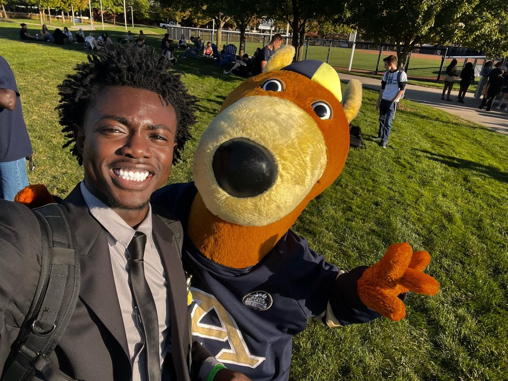

# About Me

## Hi, I'm Lanre.

I'm a Computer Science student with a growing focus on **cybersecurity**, **networking**, and **full‑stack development**. I enjoy working at the intersection of systems, security, and clean engineering — building tools and experiences that are reliable, intentional, and thoughtfully designed.

---

## My Journey Into Computer Science

My path into CS started with curiosity. I’ve always been drawn to understanding how systems work — from the structure of networks to the logic behind software. That curiosity eventually led me to programming, cybersecurity labs, and hands‑on networking environments where I could break things, fix them, and learn from the process.

As I progressed through university coursework and real projects, I found myself gravitating toward areas that require both precision and creativity: secure application design, enterprise networking, and data‑driven systems. Each project has pushed me to think more deeply about how technology behaves and how to build it responsibly.

---

## What I’m Working On

I’m currently building projects that strengthen my foundation in:

- **Cybersecurity** — PCAP analysis, protocol behavior, and secure development practices  
- **Networking** — VLAN configuration, routing, and enterprise‑scale topologies  
- **Full‑Stack Development** — Astro, Tailwind, Python, SQL, and component‑based UI design  
- **Systems Thinking** — designing architectures that are modular, scalable, and maintainable  

---

## Leadership & Community

I serve as **President of the African Student Association (ASA)**, where I focus on building community, organizing events, and creating spaces where people feel supported and connected. Leadership has taught me how to communicate clearly, collaborate effectively, and guide teams through challenges — skills that translate directly into engineering work.

I’ve also contributed as a **Fundraising Coordinator**, **Social Media Chair**, and **Orientation Leader**, roles that strengthened my ability to plan, communicate, and lead with intention.

---

## What I Value

- **Clarity** — in code, communication, and design  
- **Security‑minded thinking** — building with intention, not assumptions  
- **Continuous learning** — certifications, labs, and hands‑on experimentation  
- **Teamwork** — because the best engineering happens collaboratively  

These values shape how I approach both technical work and leadership.

---

## Outside of Tech

When I’m not debugging or configuring networks, I’m usually exploring new tools, learning about AI systems, or working on community initiatives. I enjoy connecting my technical interests with real‑world impact — whether through leadership, mentorship, or creative projects.

---

## Looking Ahead

I’m preparing for opportunities in **software engineering**, **IT**, and **cybersecurity**, with the long‑term goal of contributing to secure, scalable systems. My portfolio reflects that journey — the projects I’ve built, the problems I’ve solved, and the direction I’m growing toward.

If you’d like to connect, collaborate, or learn more about my work, feel free to reach out.
- **Personal Email: layegbusi7@gmail.com**
- **School Email:   opa10@uakron.edu**
- **Phone:          +1(216)-598-3874**
